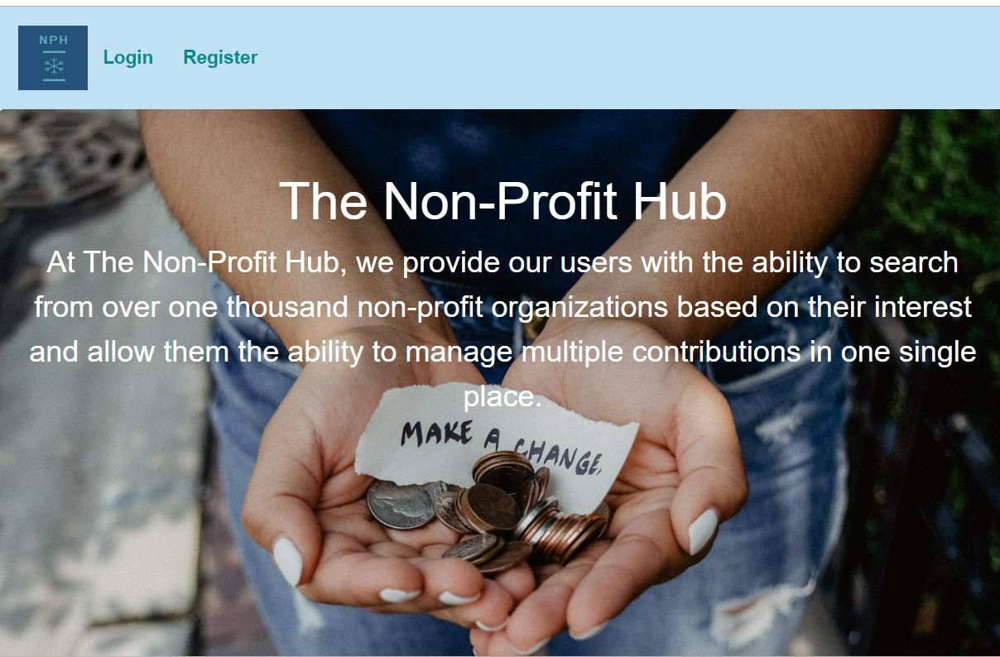

## The Non-Profit Hub

## This was the final project for the UCLA fullstack bootcamp course.
## Technologies Used
* React.js
* React Router
* REact Context
* Node.js
* passport.js
* MySQL
* Sequelize

At the Non-profit Hub, we provide our users with the ability to search from over one thousand non-profit organization based on their interest and allow them the ability to manage multiple contribution in one single place. In the project, we have main login and resister page for users to access, and users can choose their favorite non-profit organizations and donate, and this is "the non-profit hub" for all people to donate their money.

Check us out at https://project-3-z.herokuapp.com/
